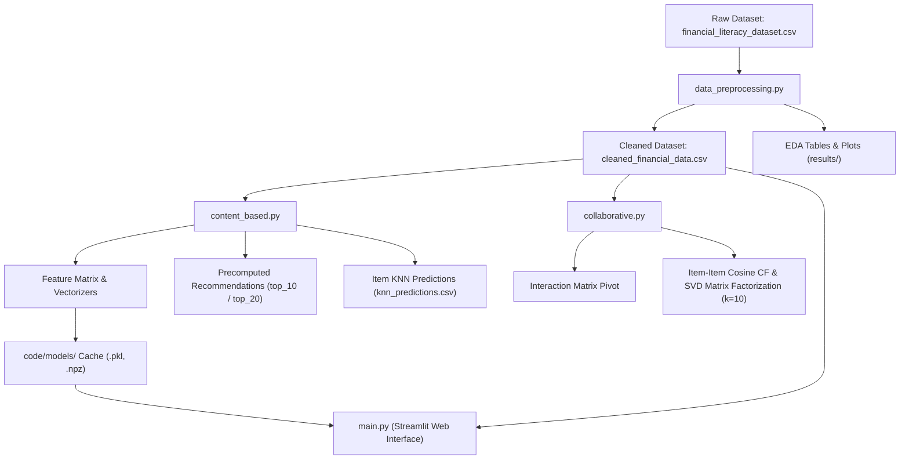
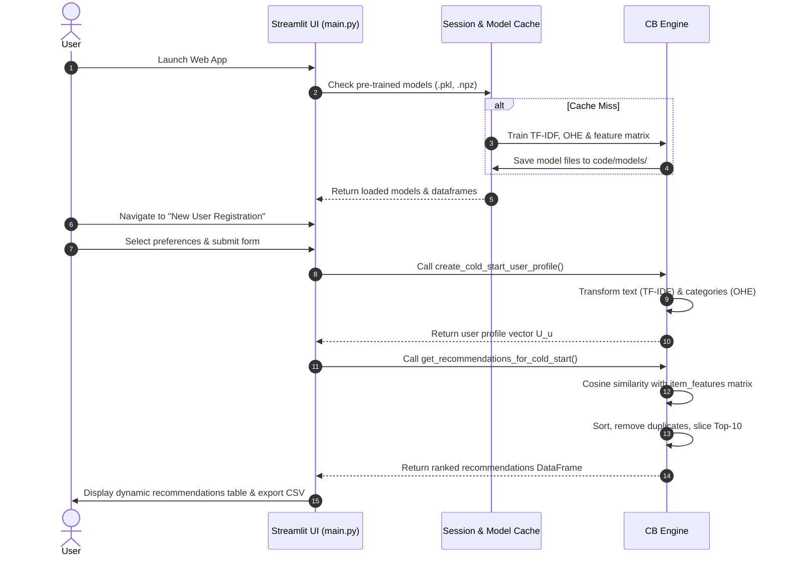

# Financial Literacy Content-Based & Hybrid Recommendation System
## Complete Technical & Architectural Project Report

---

## 1. Project Overview & Core Idea

### 1.1 Project Objectives & Problem Statement
In modern digital education, financial literacy content is vast, diverse, and rapidly growing. Users often struggle with **information overload**, failing to find materials matched to their specific knowledge level (e.g., beginner vs. advanced), preferred format (e.g., articles, videos, interactive modules), or topic interest (e.g., budgeting, stock trading, cryptocurrency).

The **Financial Literacy Recommender System** is designed to solve this problem by delivering **hyper-personalized educational recommendations**. It incorporates content-based text analysis, categorical feature encoding, numerical preference alignment, and collaborative filtering baselines to maximize user engagement and learning efficiency.

### 1.2 Core Capabilities
* **Hybrid Feature Space**: Combines natural language processing (NLP) on content titles, descriptions, and summaries with categorical metadata and numerical skill indicators.
* **Cold-Start Handling**: Constructs user profile vectors dynamically from explicit onboarding questionnaires for new users.
* **Precomputed & On-the-Fly Inference**: Enables dual-mode operations—batch evaluation for existing users and instant sub-second profile building and similarity calculation for active app users.
* **Item Deduplication & Unique Recommendation**: Guarantees distinct top-$N$ item suggestions without duplicate items or previously rated content.
* **Interactive Streamlit Web Dashboard**: Features a modern responsive UI with dynamic sidebar navigation, profile creation forms, score visualizers, and downloadable recommendation outputs.

---

## 2. High-Level Architecture & Project Structure

The project follows a clean modular design separating offline data processing, content-based feature modeling, collaborative filtering exploration, cached model artifacts, and interactive deployment.



### 2.1 Directory & File Layout

| Directory / File | Description | Purpose |
| :--- | :--- | :--- |
| `data/financial_literacy_dataset.csv` | Raw input dataset | Historical interaction logs & item metadata |
| `data/cleaned_financial_data.csv` | Preprocessed dataset | Cleaned dataset post deduplication & normalization |
| `code/data_preprocessing.py` | Data preparation script | Missing value check, duplicate cleaning, rating clipping, EDA visualizer |
| `code/content_based.py` | Core CB model script | TF-IDF text encoding, One-Hot categorical encoding, profile aggregation, cosine similarity & KNN |
| `code/collaborative.py` | Collaborative filtering script | Interaction matrix pivoting, Item-based CF, and Truncated SVD matrix factorization |
| `code/main.py` | Web Application entry | Streamlit web frontend with real-time inference, cold-start form, caching, and result visualization |
| `code/models/` | Model Persistence Cache | Serialized model files (`.pkl`, `.npz`) for instant web loading |
| `results/plots/` | Visual outputs | Generated distribution charts, user activity histograms, item popularity, and long-tail curves |
| `results/tables/` | Tabular outputs | CSV summary reports, top recommendation lists, and KNN prediction tables |

---

## 3. Data Preprocessing & Exploratory Data Analysis (EDA)

The data preprocessing engine in [`data_preprocessing.py`](file:///c:/Users/Youssef%20Ekrami/Desktop/Recommender-System-App/code/data_preprocessing.py) performs rigorous data hygiene and structural diagnostics before model training.

### 3.1 Cleaning & Normalization Steps
1. **Missing Value Audit**: Evaluates null values across all features (`title`, `description`, `summary`, `primary_topic`, `subtopic`, `difficulty`, `content_type`, `financial_knowledge`).
2. **De-duplication**: Identifies and removes duplicate user-item interaction entries using `df.drop_duplicates()`.
3. **Rating Scale Clipping**: Validates explicit ratings and bounds values strictly to the $[1.0, 5.0]$ range using `np.clip(df['rating'], 1, 5)`.

### 3.2 Sparsity & Interaction Metrics
Data sparsity measures the proportion of unobserved user-item interactions within the interaction matrix:

$$\text{Sparsity} = 1 - \frac{|R|}{|U| \times |I|}$$

Where $|R|$ is total interactions, $|U|$ is total unique users, and $|I|$ is total unique items.

### 3.3 Long-Tail & Popularity Distribution Analysis
The pipeline evaluates content consumption imbalance (Pareto Principle / 80-20 rule) by sorting item popularity and computing the cumulative percentage of interactions:

$$\text{Imbalance Index} = \frac{\% \text{ Interactions from Top 20\% Items}}{20\%}$$

* If $\text{Imbalance Index} > 4.0$ (over 80% interactions from 20% items), a **strong long-tail problem** exists, emphasizing the necessity of Content-Based filtering over pure popularity recommendations.

---

## 4. Feature Engineering & Matrix Construction

The Content-Based filtering engine converts heterogeneous textual, categorical, and numerical item attributes into a unified high-dimensional vector space.

```mermaid
flowchart LR
    subgraph Text Data
        T1[Title]
        T2[Description]
        T3[Summary]
    end

    subgraph Categorical Data
        C1[Primary Topic]
        C2[Subtopic]
        C3[Difficulty]
        C4[Content Type]
    end

    subgraph Numerical Data
        N1[Financial Knowledge Level]
    end

    Text Data -->|Concatenation| CombinedText["text_combined"]
    CombinedText -->|TF-IDF Vectorizer max_features=500| TFIDF_Matrix["Text Features Sparse Matrix (N x 500)"]

    Categorical Data -->|One-Hot Encoder| OHE_Matrix["Categorical Features Dense/Sparse Matrix"]

    Numerical Data -->|Ordinal Mapping: beginner=1, intermediate=2, advanced=3| Num_Matrix["Numerical Feature Column (N x 1)"]

    TFIDF_Matrix --> Stacking["scipy.sparse.hstack"]
    OHE_Matrix --> Stacking
    Num_Matrix --> Stacking

    Stacking --> UnifiedMatrix["item_features CSR Matrix"]
```

### 4.1 Feature Extraction Details

#### 1. Textual Feature Representation (TF-IDF)
* **Input Fields**: `title`, `description`, `summary` concatenated into `text_combined`.
* **Method**: Term Frequency-Inverse Document Frequency ([TfidfVectorizer](file:///c:/Users/Youssef%20Ekrami/Desktop/Recommender-System-App/code/content_based.py#L41)).
* **Parameters**: `stop_words='english'`, `max_features=500`.
* **Formula**:
  $$\text{TF-IDF}(t, d, D) = \text{TF}(t, d) \times \log\left(\frac{|D|}{1 + |\{d \in D : t \in d\}|}\right)$$
* **Why Used**: Captures domain-specific financial vocabulary (e.g., *dividend*, *portfolio*, *mortgage*, *inflation*) and reduces weights of generic terms.

#### 2. Categorical Feature Encoding (One-Hot Encoding)
* **Input Fields**: `primary_topic`, `subtopic`, `difficulty`, `content_type`.
* **Method**: [OneHotEncoder](file:///c:/Users/Youssef%20Ekrami/Desktop/Recommender-System-App/code/content_based.py#L46).
* **Parameters**: `handle_unknown='ignore'`.
* **Why Used**: Transforms nominal categories into orthogonal binary vectors, ensuring topic and format metadata exert strong spatial separation in distance calculations.

#### 3. Numerical Feature Encoding (Ordinal Mapping)
* **Input Field**: `financial_knowledge`.
* **Mapping**: `{'beginner': 1, 'intermediate': 2, 'advanced': 3}`.
* **Why Used**: Establishes numerical distance between difficulty expectations, penalizing recommendations that are far above or below a user's knowledge stage.

#### 4. Sparse Matrix Concatenation
All feature blocks are horizontally combined using [`scipy.sparse.hstack`](file:///c:/Users/Youssef%20Ekrami/Desktop/Recommender-System-App/code/content_based.py#L56) and transformed into a Compressed Sparse Row (`CSR`) matrix `item_features`, enabling efficient linear algebra operations.

---

## 5. Recommendation Algorithms & Implementation Methods

The system incorporates three recommendation methods, each selected to serve specific architectural requirements.

### 5.1 Method 1: Content-Based Cosine Similarity Filtering

#### Where Used
* In [`code/content_based.py`](file:///c:/Users/Youssef%20Ekrami/Desktop/Recommender-System-App/code/content_based.py#L68-L123) for offline precomputation of Top-10 and Top-20 recommendation tables.
* In [`code/main.py`](file:///c:/Users/Youssef%20Ekrami/Desktop/Recommender-System-App/code/main.py#L263-L298) for live cold-start recommendations.

#### User Profile Construction
* **For Existing Users**: Calculated as the rating-weighted centroid of item feature vectors for all items rated by user $u$:
  $$U_u = \frac{\sum_{i \in \text{Rated}(u)} r_{u,i} \cdot \vec{f}_i}{\sum_{i \in \text{Rated}(u)} r_{u,i}}$$
  where $\vec{f}_i$ is item feature vector $i$ and $r_{u,i}$ is user rating.

* **For Cold-Start Users**: Constructed directly from explicit onboarding preferences:
  * Textual entries (interests, topic selections) transformed via fitted `tfidf_vectorizer`.
  * Selected categories transformed via fitted `onehot_encoder`.
  * Knowledge level mapped to ordinal scale $[1, 3]$.

#### Similarity Score Computation
The similarity between user profile vector $U_u$ and all item feature vectors $I$ is calculated using Cosine Similarity:

$$\text{Sim}(U_u, I_i) = \cos(\theta) = \frac{U_u \cdot I_i}{\|U_u\|_2 \|I_i\|_2}$$

#### Why Used
* Solves the **Cold-Start Problem** for new items and new users.
* High transparency and interpretability of recommendation scores.
* Does not require dense user interaction histories.

---

### 5.2 Method 2: Item-Based Nearest Neighbors (KNN)

#### Where Used
* In [`code/content_based.py`](file:///c:/Users/Youssef%20Ekrami/Desktop/Recommender-System-App/code/content_based.py#L140-L178) for content-based item similarity modeling and prediction generation (`knn_predictions.csv`).

#### Algorithm Details
* **Model Class**: `sklearn.neighbors.NearestNeighbors(metric='cosine', algorithm='brute')`.
* **Neighbor Retrieval**: Retrieves top $k$ ($k=10, 20$) most similar content items for every item in the dataset.
* **Rating Prediction Formula**:
  $$\hat{r}_{u,i} = \frac{\sum_{j \in \text{KNN}(i)} r_{u,j} \cdot \text{sim}(i, j)}{\sum_{j \in \text{KNN}(i)} \text{sim}(i, j)}$$
  If $\sum \text{sim}(i, j) = 0$, falls back to global average rating $\bar{r}$.

#### Why Used
* Enables item-to-item similarity discovery ("Users who liked this topic also like...").
* Precomputes static item neighborhood graphs independent of dynamic user updates.

---

### 5.3 Method 3: Collaborative Filtering & Matrix Factorization (SVD)

#### Where Used
* In [`code/collaborative.py`](file:///c:/Users/Youssef%20Ekrami/Desktop/Recommender-System-App/code/collaborative.py) as an offline exploratory/comparative collaborative filtering baseline.

#### Technical Details
1. **User-Item Matrix Pivoting**: Constructs matrix $R \in \mathbb{R}^{|U| \times |I|}$ populated with interaction ratings, zero-filling unobserved interactions.
2. **Item-Item Collaborative Cosine Similarity**: Computes similarity across column vectors of interaction matrix $R$.
3. **Truncated Singular Value Decomposition (SVD)**:
   Matrix factorization with $k=10$ latent factors using `scipy.sparse.linalg.svds`:
   $$R \approx U_k \Sigma_k V_k^T$$
   Where:
   * $U_k \in \mathbb{R}^{|U| \times k}$: User latent feature matrix.
   * $\Sigma_k \in \mathbb{R}^{k \times k}$: Singular value diagonal matrix.
   * $V_k^T \in \mathbb{R}^{k \times |I|}$: Item latent feature matrix.
4. **Reconstructed Rating Prediction Matrix**:
   $$\hat{R} = U_k \Sigma_k V_k^T$$

#### Why Used
* Evaluates latent behavioral preference patterns uncaptured by explicit content tags.
* Serves as benchmark for prospective Hybrid (Content + Collaborative) system expansions.

---

## 6. Streamlit Web Application Pipeline (`main.py`)

The Streamlit web application is designed to deliver high performance, instant feedback, and intuitive user interaction.



### 6.1 Performance Optimization & Caching Strategy
To ensure immediate response times, [`main.py`](file:///c:/Users/Youssef%20Ekrami/Desktop/Recommender-System-App/code/main.py) utilizes Streamlit caching decorators:
* [`@st.cache_data`](file:///c:/Users/Youssef%20Ekrami/Desktop/Recommender-System-App/code/main.py#L39): Caches dataset loading (`cleaned_financial_data.csv`) and precomputed recommendation CSV files (`top_10_recommendations.csv`, `top_20_recommendations.csv`).
* [`@st.cache_resource`](file:///c:/Users/Youssef%20Ekrami/Desktop/Recommender-System-App/code/main.py#L45): Caches non-serializable machine learning objects in memory (`tfidf_vectorizer`, `onehot_encoder`, `item_features` CSR matrix).

### 6.2 Modern Dark-Themed Sidebar Navigation
Custom CSS injection ([`inject_sidebar_style()`](file:///c:/Users/Youssef%20Ekrami/Desktop/Recommender-System-App/code/main.py#L125)) customizes Streamlit's default components, providing sleek dark gradients (`#0f1724` to `#071028`), customized button styling (`#2563eb`), and clean layout structures.

### 6.3 Application Pages Overview
1. **Home**: Displays introductory system details and high-level dataset metrics (Total Users, Total Items, Unique Topics, Average Rating).
2. **New User Registration**: An onboarding questionnaire capturing user financial knowledge level, primary topic interest, subtopic interest, difficulty preference, content format, and free-form interest keywords.
3. **Recommendations**: Displays computed top recommendations with score formatting ($\%.4f$), deduplication confirmation, expandable detailed item descriptions, and a CSV download button (`my_recommendations.csv`).
4. **System Info**: Transparency view showing feature matrix shapes, vectorizer parameters, sample precomputed recommendations, and implementation details.

---

## 7. Data Structure & Taxonomy Summary

### 7.1 Input Categories & Enumerations

| Category Category | Available Values / Options | Used In |
| :--- | :--- | :--- |
| **Financial Knowledge** | `beginner`, `intermediate`, `advanced` (mapped to 1, 2, 3) | Preprocessing, Feature Matrix, Cold-Start Form |
| **Difficulty Level** | `beginner`, `intermediate`, `advanced` | Categorical OHE Feature |
| **Content Type** | `article`, `video`, `course`, `interactive`, `podcast` (varies by dataset) | Categorical OHE Feature |
| **Primary Topic** | Budgeting, Investing, Debt Management, Retirement, Taxes, Crypto, Insurance, etc. | Categorical OHE & Text Feature |
| **Rating Range** | Floating point scale bounded to $[1.0, 5.0]$ | Rating Weighting & Similarity Scoring |

### 7.2 Core Data Structures & File Types

| Object / File Name | Data Type | Dimensions / Format | Storage Location |
| :--- | :--- | :--- | :--- |
| `item_features.npz` | `scipy.sparse.csr_matrix` | $(N_{\text{items}}, 500 + N_{\text{cat}} + 1)$ | `code/models/item_features.npz` |
| `tfidf_vectorizer.pkl` | `sklearn.feature_extraction.text.TfidfVectorizer` | Pickled Object (max 500 vocabulary) | `code/models/tfidf_vectorizer.pkl` |
| `onehot_encoder.pkl` | `sklearn.preprocessing.OneHotEncoder` | Pickled Object | `code/models/onehot_encoder.pkl` |
| `item_ids.pkl` | `numpy.ndarray` | $(N_{\text{items}},)$ | `code/models/item_ids.pkl` |
| `processed_df.pkl` | `pandas.DataFrame` | Pickled DataFrame | `code/models/processed_df.pkl` |
| `top_10_recommendations.csv` | CSV File | Columns: `user_id`, `item_id`, `score`, `title`, metadata | `results/tables/content_based/` |
| `top_20_recommendations.csv` | CSV File | Columns: `user_id`, `item_id`, `score`, `title`, metadata | `results/tables/content_based/` |
| `knn_predictions.csv` | CSV File | Columns: `user_id`, `item_id`, `pred_rating` | `results/tables/content_based/` |
| `svd_recommendations_10.csv` | CSV File | Columns: `recommended_item`, `predicted_rating` | `results/tables/CollaborativeFiltering/` |

---

## 8. Summary of Generated Output Artifacts

Running the complete pipeline produces a full suite of analytical plots and tabular results saved directly under the `results/` directory:

### 8.1 Plots (`results/plots/data_preprocessing/`)
* `rating_distribution.png`: Bar chart displaying frequency distribution across rating values 1–5.
* `user_activity_distribution.png`: Dual plot with user activity segmentation pie chart (Very Active vs Moderate vs Inactive) and interaction count histogram.
* `item_popularity_distribution.png`: Horizontal bar chart of top 20 items alongside item popularity distribution histogram.
* `long_tail_analysis.png`: Cumulative interaction curve highlighting Pareto distribution, short-tail threshold (20% items), and calculated imbalance percentage.

### 8.2 Tables (`results/tables/`)
* `basic_statistics.csv`: Dataset counts and global sparsity percentage.
* `*_distribution.csv`: Frequency tables for Ratings, Knowledge Levels, Content Difficulties, Content Types, and Primary Topics.
* `detailed_statistics.csv`: Summary statistics (`describe(include='all')`) across all dataset columns.
* `long_tail_report.csv`: Pareto ratio metrics and imbalance index.
* `top_10_recommendations.csv` & `top_20_recommendations.csv`: Precomputed personalized recommendations with metadata.
* `knn_predictions.csv`: KNN item-based rating predictions for user-item combinations.
* `item_based_cf_result.csv` & `svd_recommendations_10.csv`: Collaborative filtering recommendations.

---

## 9. Conclusion & Future Roadmap

The **Financial Literacy Content-Based Recommendation System** provides a complete, robust, and scalable solution for personalizing educational content. By combining TF-IDF NLP features, categorical one-hot vectors, ordinal skill levels, explicit cold-start onboarding, and interactive Streamlit deployment, the platform delivers precise, transparent, and immediate recommendations.

### Key Strengths
1. **Cold-Start Resilience**: New users immediately receive customized recommendations upon filling preference forms.
2. **Cached High-Performance Engine**: Precomputations and memory caching enable instant inference without database lag.
3. **Multi-Model Capability**: Supports content-based similarity, item KNN retrieval, and matrix factorization.

### Potential Future Enhancements
* **Hybrid Integration**: Blending Content-Based Cosine Scores with SVD Matrix Factorization predictions via weighted ensemble scoring.
* **Deep Learning Embeddings**: Replacing TF-IDF with Sentence Transformers (e.g., `all-MiniLM-L6-v2`) to capture semantic sentence context.
* **Implicit Feedback Modeling**: Incorporating reading time, scroll depth, and bookmarking interactions alongside explicit star ratings.

---
*Report generated for Group 19 Financial Literacy Recommender System Project.*
